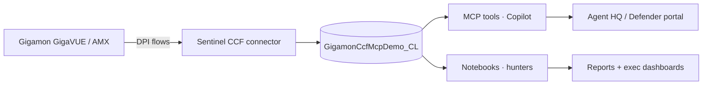

# Gigamon × Microsoft Sentinel — Jupyter Notebooks

A companion repo to [`gigamon-sentinel-mcp-demo-ui`](https://github.com/MitchellGulledge3/gigamon-sentinel-mcp-demo-ui) that demonstrates how a security team can **explore** the same Gigamon CCF data that the MCP tools answer questions about.

## Why notebooks alongside MCP tools?

| Surface | When you reach for it |
| --- | --- |
| **MCP tools** in Security Copilot | "Are any TLS clients fingerprinting as Cobalt Strike?" — one prompt, one answer. |
| **Notebooks in this repo** | "Walk me through every JA3 fingerprint we saw, cluster the rare ones, and let me drill into the top 5 outliers." — open exploration. |

Same source table: `GigamonCcfMcpDemo_CL`. Same workspace ID. Different audience and different cognitive mode.

---

## The 5 notebooks

1. **`01-getting-started-sentinel-datalake.ipynb`** — Auth with `DefaultAzureCredential`, connect to Log Analytics via `azure-monitor-query`, run your first KQL.
2. **`02-lateral-movement-investigation.ipynb`** — Pull east-west SMB/RDP/SSH flows, build a NetworkX directed graph, and plot the lateral-movement topology.
3. **`03-ja3-fingerprint-hunting.ipynb`** — Histogram every TLS JA3 you've seen, cluster rare fingerprints, and drill into known-bad hits.
4. **`04-beacon-periodicity-analysis.ipynb`** — Per-flow inter-arrival times, FFT for periodicity, jitter/IQR per (src,dst,port).
5. **`05-app-mix-dashboard.ipynb`** — Plotly Sankey: `app_family → app_name → bytes`. Shadow IT bars. Drop into a leadership deck.

Each notebook is self-contained and uses **only** the Gigamon CCF schema.

---

## What it looks like

Live captures from the executed notebooks (see [`screenshots/`](./screenshots/) for the full gallery):

**Flagship — JA3 known-bad matches (536 hits across 6 threat families)**


**JA3 fingerprint volume histogram**


**East-west lateral movement graph**


**Application-mix Sankey (Gigamon AMX app identification)**


---

## Microsoft Security Store package

The repo ships a pre-built [Security Store](https://learn.microsoft.com/security/store/publish-a-security-copilot-agent-or-analytics-solution-in-security-store)
upload artifact for all five notebooks under [`security-store-package/`](./security-store-package/):

- `PackageManifest.yaml` (type `SentinelLake`) + `AgentManifest.yaml`
- One `.job.yaml` per notebook (default schedules: hourly for beacon hunt, daily for JA3 and app-mix, on-demand for the rest)
- Pre-built zip: [`gigamon-sentinel-notebooks-store-package.zip`](./security-store-package/gigamon-sentinel-notebooks-store-package.zip)

See [`security-store-package/PACKAGING.md`](./security-store-package/PACKAGING.md) for the exact macOS commands to rebuild the zip and the Partner Center upload steps.

---

## Quick start

```bash
git clone https://github.com/MitchellGulledge3/gigamon-sentinel-notebooks.git
cd gigamon-sentinel-notebooks
python -m venv .venv && source .venv/bin/activate
pip install -r requirements.txt
cp .env.example .env       # fill in WORKSPACE_ID
az login
jupyter lab
```

## Configuration

`.env` keys (see `.env.example`):

| Key | Required | Notes |
| --- | --- | --- |
| `WORKSPACE_ID` | yes | Log Analytics workspace GUID for your Sentinel data lake. |
| `TENANT_ID` | optional | Override the Azure CLI default tenant. Gigamon onboarded tenant: `0927b619-f6e4-4461-bcda-333194268117`. |
| `TIMERANGE_HOURS` | optional | Default `24`. |

---

## How this fits the broader story



The 8 MCP tools in the sibling repo and the 5 notebooks here both read the same table. Investing in the CCF connector pays off twice.

---

## License

MIT. See [`LICENSE`](./LICENSE).
