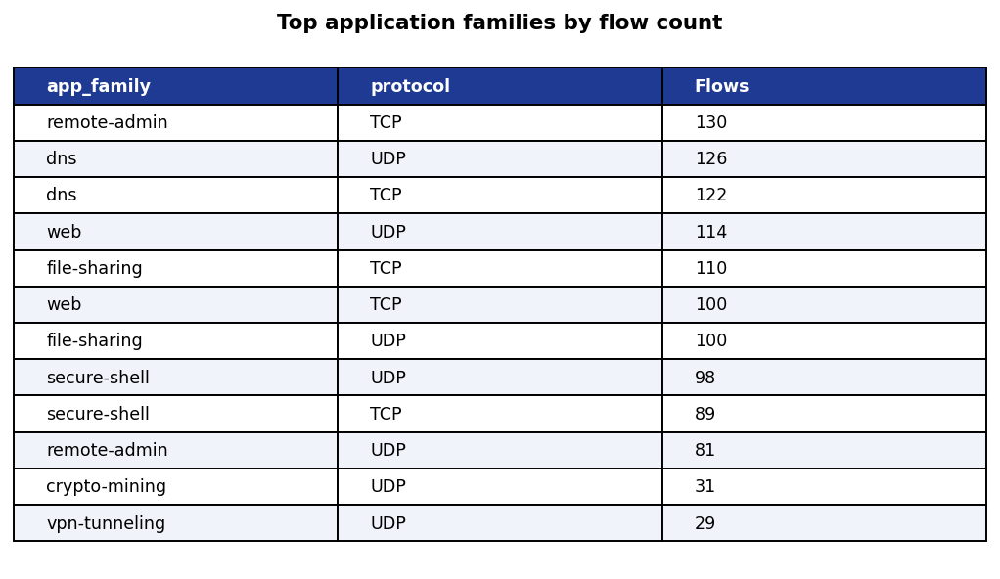
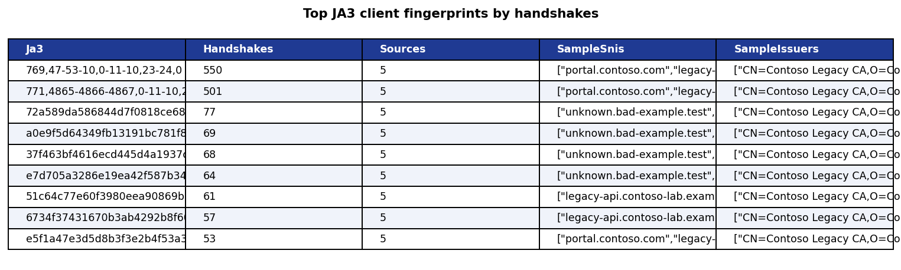
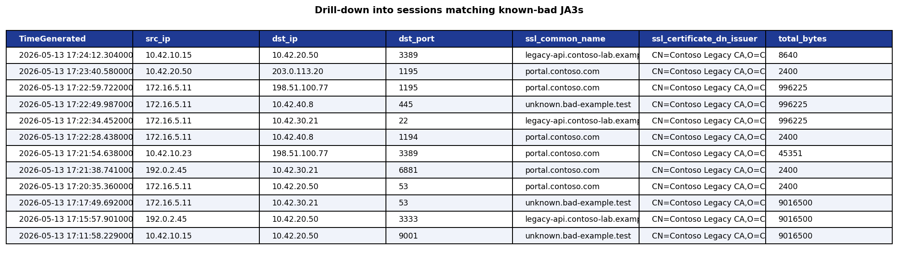
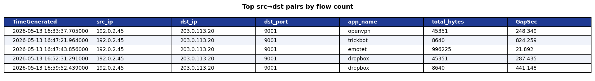

# Notebook output gallery

Real captured outputs from the executed notebooks — the same view you see when
you run them in VS Code against the Sentinel data lake. These PNGs are
referenced from the top-level README and the Security Store package README so
reviewers can preview results without opening Jupyter.

## 01 — Getting started

**Posture summary**


**Top application families by flow count**


## 02 — Lateral movement investigation

**East-west graph (NetworkX)**


## 03 — JA3 fingerprint hunting

**Top JA3 fingerprints by handshakes (histogram)**


**Top JA3 client fingerprints (table)**


**Known-bad JA3 matches — 536 hits across 6 threat families** ⚑


**Drill-down into sessions matching known-bad JA3s**


## 04 — Beacon periodicity analysis

**Top src→dst pairs by flow count**


## 05 — App mix / shadow IT dashboard

**Application-mix Sankey** (Plotly → exported via kaleido)


**High-risk shadow IT categories**


## How these were generated

- `*.png` images embedded in the notebook outputs (matplotlib / NetworkX) were
  base64-extracted directly from the `.ipynb` files.
- The Plotly Sankey JSON in notebook 05 was rendered to PNG with
  `plotly.io.write_image(..., width=1200, height=600)` (requires `kaleido`).
- DataFrame outputs were re-rendered with matplotlib `Axes.table()` for clean
  static previews.

To regenerate after re-executing the notebooks:

```bash
source .venv/bin/activate
pip install -q kaleido
python3 scripts/extract_screenshots.py    # script lives in this folder
```
