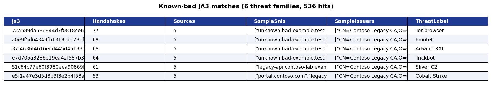
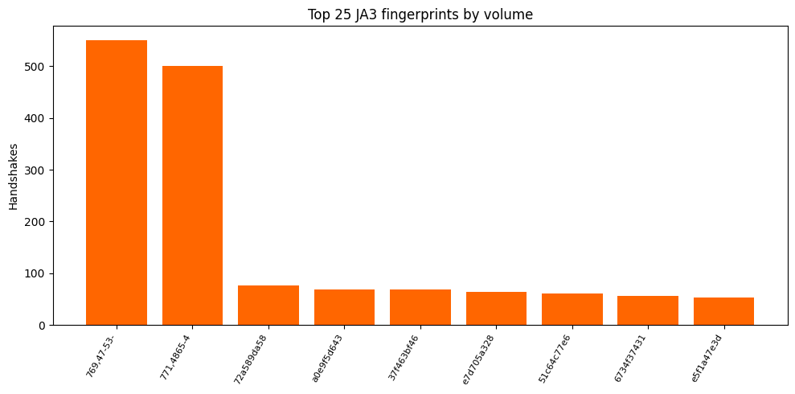
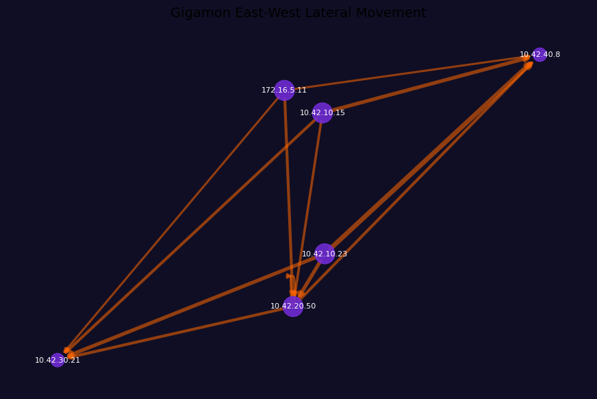
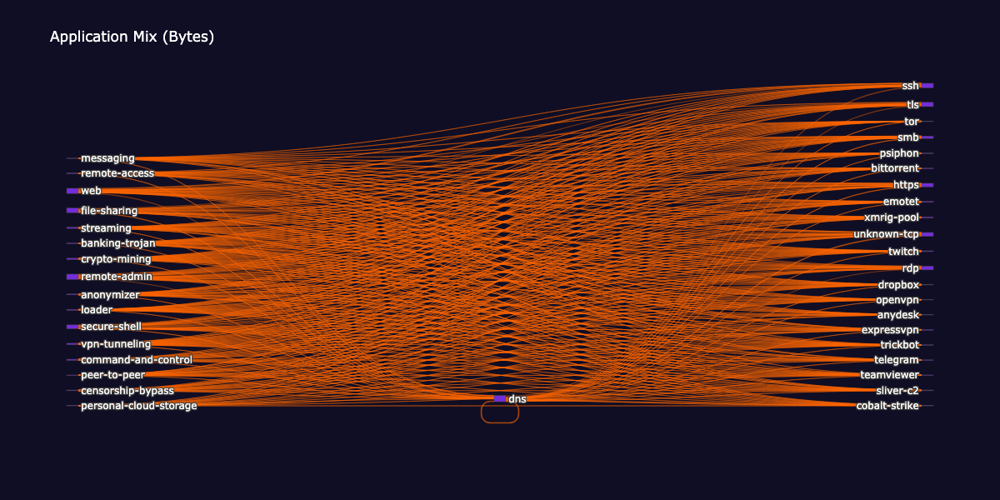
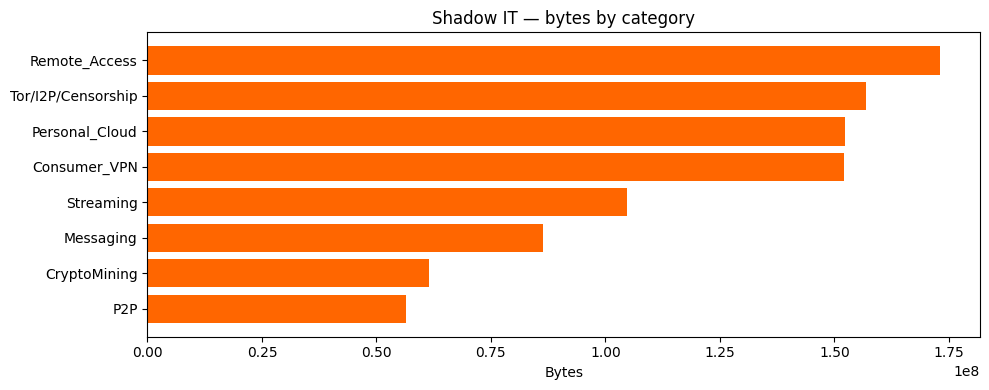

# Gigamon Deep Observability Hunting Pack — Sentinel Data Lake

Notebook-only Microsoft Security Store package containing five Jupyter notebooks
that hunt threats in Gigamon AMX network telemetry stored in the Microsoft
Sentinel data lake.

## Sample outputs

Live captures from the executed notebooks — see the full gallery in [`../screenshots/`](../screenshots/):

| Notebook | Preview |
|---|---|
| **03 JA3 known-bad matches** (flagship — 536 hits / 6 threat families) |  |
| **03 JA3 histogram** |  |
| **02 Lateral movement graph** |  |
| **05 Application-mix Sankey** |  |
| **05 Shadow IT bars** |  |
| **01 Posture summary** |  |

## Contents

```
PackageManifest.yaml          # Security Store package descriptor
AgentManifest.yaml            # Platform solution manifest (Sentinel)
notebooks/
  01-getting-started-sentinel-datalake.ipynb   + .job.yaml
  02-lateral-movement-investigation.ipynb      + .job.yaml
  03-ja3-fingerprint-hunting.ipynb             + .job.yaml
  04-beacon-periodicity-analysis.ipynb         + .job.yaml
  05-app-mix-dashboard.ipynb                   + .job.yaml
```

## Data source

All notebooks target the `GigamonAMXNetworkLog` table emitted by the Gigamon
connector for Microsoft Sentinel. The connector must be installed and ingesting
before scheduling the jobs.

## Jobs and schedules

| Notebook | Default schedule | Purpose |
|---|---|---|
| 01 Getting started | OnDemand | Posture baseline |
| 02 Lateral movement | OnDemand | East-west graph |
| 03 JA3 hunting | Daily 00:00 UTC | TLS fingerprint threat match |
| 04 Beacon periodicity | Hourly | C2 beacon detection |
| 05 App mix / shadow IT | Daily 01:00 UTC | Application-mix dashboard |

Edit the corresponding `.job.yaml` file to change the schedule.

## Publishing

This package is structured for upload to the Microsoft Security Store as a
platform solution offer. See
[Publish a Security Copilot agent or analytics solution in Security Store](https://learn.microsoft.com/security/store/publish-a-security-copilot-agent-or-analytics-solution-in-security-store).

## Reference implementation

Source notebooks, sample data, and the companion MCP tools repo live at
<https://github.com/MitchellGulledge3/gigamon-sentinel-notebooks>.
